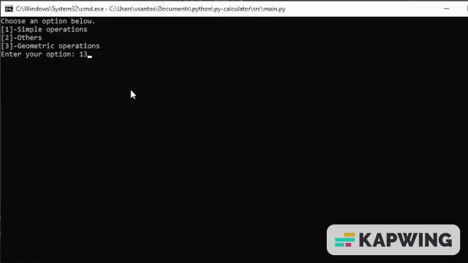

# Python console-calculator

Simple console built in python.

## Getting Started

These instructions will give you a copy of the project up and running on
your local machine for development and testing purposes.

### Pre-requisites

Requirements for the software and other tools to build and test.

```
$ python <version>  3+
```

### Installing

A step by step series of examples that tell you how to get a development
environment running

Requirements to run python.

```bash
$ pip install -r requirements.txt

```

## Running scripts with python

Explain how to run the automated tests for this system

```
$ path to ./src/main.py and open.
```

### Sample Tests



## Built With

- [Python](https://www.python.org/) - Used
  for the Code.
- [Creative Commons](https://creativecommons.org/) - Used to choose
  the license

## License

This project is licensed under the [CC0 1.0 Universal](LICENSE.md)
Creative Commons License - see the [LICENSE.md](LICENSE.md) file for
details
